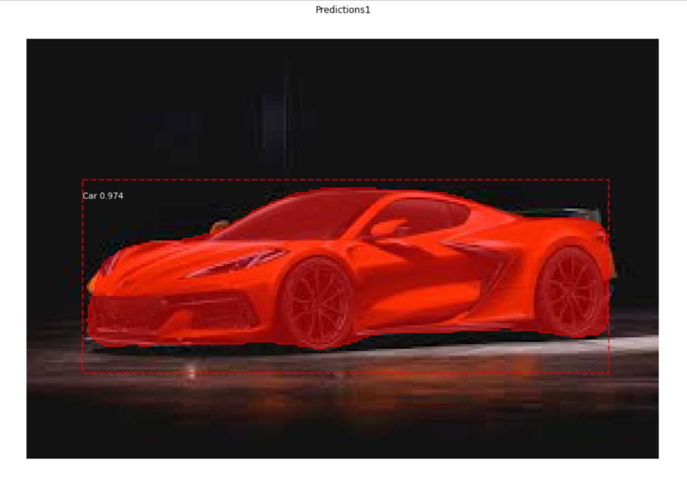
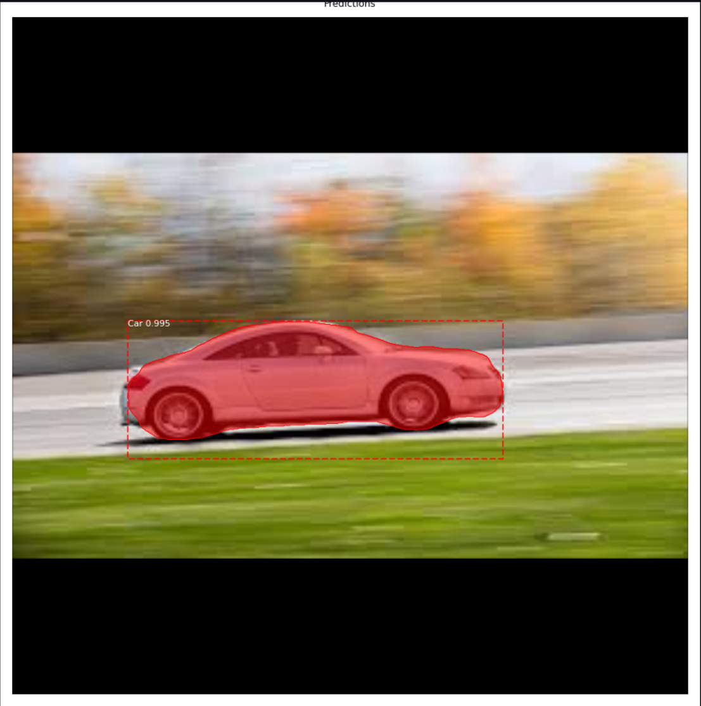

# 
Mask RCNN On Custom Dataset 🚀

## Overview

Mask R-CNN (Mask Region-based Convolutional Neural Network) is an extension of the popular Faster R-CNN object detection model. Mask R-CNN on a custom dataset offers a powerful solution for tasks requiring both object detection and instance segmentation, such as medical image analysis, autonomous driving, and industrial automation. 

## Examples

&nbsp;&nbsp;&nbsp;&nbsp;

## Workflows

1. Download mrcnn folder from https://github.com/matterport/Mask_RCNN
2. Download coco weights : https://github.com/matterport/Mask_RCNN/releases/tag/v1.0
3. Create dataset folder. Under dataset folder -> Create 2 folders "train" and "val".
4. Put training images in train folder
5. Put validation images in val folder
6. Make image annotations
